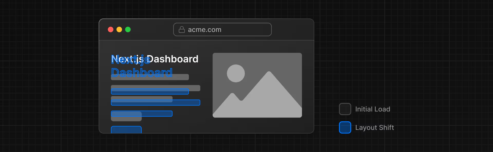

# Next.js App Course

This course teaches how to build a simple financial dashboard that has a home page, a login page, and dashboard pages that are protected by authentication. Users can add, edit and delete invoices. These features are supported by an accompanying Postgres database.


## Table of Contents

- [Next.js App Course](#nextjs-app-course)
  - [Table of Contents](#table-of-contents)
  - [Steps](#steps)
    - [Init](#init)
    - [1. Styling](#1-styling)
    - [2. Optimizations](#2-optimizations)
    - [3. Routing](#3-routing)
    - [4. Data Population](#4-data-population)
    - [5. Data Fetching](#5-data-fetching)
    - [6. Data Streaming](#6-data-streaming)
    - [7. Search and Pagination](#7-search-and-pagination)
    - [8. Forms](#8-forms)
    - [9. Authentication](#9-authentication)
    - [10. Metadata](#10-metadata)
  - [Links](#links)


## Steps

### Init

```bash
npm install -g pnpm
npx create-next-app@latest
```

### 1. Styling

> The different ways to style your application in Next.js

Add global styles by navigating to `/app/layout.tsx` and importing `global.css` file.
```ts
// /app/layout.tsx
import '@/app/ui/global.css';

export default function RootLayout(...)
```

---

Use [Tailwind CSS](https://tailwindcss.com/) to quickly write utility classes directly in TSX markup. To do so, add the following lines in `global.css`.
```css
/* /app/ui/global.css */
@tailwind base;
@tailwind components;
@tailwind utilities;
```

---

Use [CSS Modules](https://nextjs.org/docs/basic-features/built-in-css-support) to scope CSS to a component. To do so, navigate to `/app/ui`, create a new file called `<name>.module.css` and add CSS rules. Then use it in the `className`.
```tsx
// /app/page.tsx
import styles from '@/app/ui/home.module.css';
 
export default function Page() {
  return (
    <main className="flex min-h-screen flex-col p-6">
      <div className={styles.shape} />
    // ...
  )
}
```

---

Use the [clsx](https://www.npmjs.com/package/clsx) library to toggle class names and conditionally style an element. To do so, import `clsx` and use it in the `className`.
```tsx
// /app/ui/invoices/status.tsx
import clsx from 'clsx';
 
export default function InvoiceStatus({ status }: { status: string }) {
  return (
    <span
      className={clsx(
        'inline-flex items-center rounded-full px-2 py-1 text-sm',
        {
          'bg-gray-100 text-gray-500': status === 'pending',
          'bg-green-500 text-white': status === 'paid',
        },
      )}
    >
    // ...
  )
}
```

---

Other styling solutions: Sass, [styled-jsx](https://github.com/vercel/styled-jsx), [styled-components](https://github.com/vercel/next.js/tree/canary/examples/with-styled-components), [emotion](https://github.com/vercel/next.js/tree/canary/examples/with-emotion).

### 2. Optimizations

> How to optimize fonts and images

[Cumulative Layout Shift](https://vercel.com/blog/how-core-web-vitals-affect-seo) is a metric used by Google to evaluate the performance and user experience of a website. With fonts, layout shift happens when the browser initially renders text in a fallback or system font and then swaps it out for a custom font once it has loaded. This swap can cause the text size, spacing, or layout to change, shifting elements around it.



Next.js automatically optimizes fonts in the application when you use the `next/font` module. It downloads font files at build time and hosts them with your other static assets. This means when a user visits your application, there are no additional network requests for fonts which would impact performance.

Navigate to `/app/ui` and create a new file called `fonts.ts` for storing all fonts. Import fonts from `next/font/google` module and specify what [subset](https://fonts.google.com/knowledge/glossary/subsetting) to load. Then use it in the `className`. You can also add the Tailwind [`antialiased`](https://tailwindcss.com/docs/font-smoothing) class to smooth out the font.

```ts
// /app/ui/fonts.ts
import { Inter } from 'next/font/google';
 
export const inter = Inter({ subsets: ['latin'] });
```

```ts
// /app/layout.tsx
import '@/app/ui/global.css';
import { inter } from '@/app/ui/fonts';
 
export default function RootLayout({
  children,
}: {
  children: React.ReactNode;
}) {
  return (
    <html lang="en">
      <body className={`${inter.className} antialiased`}>{children}</body>
    </html>
  );
}
```

---

Next.js can serve static assets, like images, under the top-level /public folder. Files inside /public can be referenced in your application. With the regular HTML `` tag, you have to manually:
* Ensure your image is responsive on different screen sizes
* Specify image sizes for different devices.
* Prevent layout shift as the images load.
* Lazy load images that are outside the user's viewport.

You can use the `next/image` component to automatically optimize your images. The `<Image>` Component is an extension of the HTML `` tag, and comes with automatic image optimization, such as:
* Preventing layout shift automatically when images are loading.
* Resizing images to avoid shipping large images to devices with a smaller viewport.
* Lazy loading images by default (images load as they enter the viewport).
* Serving images in modern formats, like WebP and AVIF, when the browser supports it.

```tsx
import Image from 'next/image';
 
export default function Page() {
  return (
    // ...
    <div className="flex items-center justify-center p-6 md:w-3/5 md:px-28 md:py-12">
        <Image
            src="/hero-desktop.png"
            width={1000}
            height={760}
            className="hidden md:block"
            alt="Screenshots of the dashboard project showing desktop version"
        />
        <Image
            src="/hero-mobile.png"
            width={560}
            height={620}
            className="block md:hidden"
            alt="Screenshots of the dashboard project showing desktop version"
        />
    </div>
    //...
  );
}
```

Useful links:
* [Image Optimization Docs](https://nextjs.org/docs/app/building-your-application/optimizing/images)
* [Font Optimization Docs](https://nextjs.org/docs/app/building-your-application/optimizing/fonts)
* [Improving Web Performance with Images (MDN)](https://developer.mozilla.org/en-US/docs/Learn/Performance/Multimedia)
* [Web Fonts (MDN)](https://developer.mozilla.org/en-US/docs/Learn/CSS/Styling_text/Web_fonts)
* [How Core Web Vitals Affect SEO](https://vercel.com/blog/how-core-web-vitals-affect-seo)

### 3. Routing

> How to create nested layouts and pages using file-system routing

With a traditional React SPA, the browser loads all your application code on initial load. With Next.js, on the server, your application code is automatically code-split by route segments. And on the client, the route segments are prefetched and cached.
* Isolation: If a certain page throws an error, the rest of the application will still work.
* Improved performance: Only the code needed for the current route is loaded on navigation.
* Soft navigation: Routes are automatically prefetched as `<Link>` components become visible in the user's viewport. When a user navigates to the new route, the browser only re-renders the route segments that change and does not reload the entire page (partial rendering).

Read more: [How routing and navigation works](https://nextjs.org/docs/app/building-your-application/routing/linking-and-navigating#how-routing-and-navigation-works)

---

Next.js uses file-system routing where folders are used to create nested routes. Each folder represents a route segment that maps to a URL segment.


`page.tsx` is a special Next.js file that exports a React component for a route to be accessible.

```tsx
// /app/dashboard/page.tsx
export default function Page() {
  return <p>Dashboard Page</p>;
}
```

---

You can achieve partial rendering by using layouts. Only the page components update while the layout won't re-render.


`layout.tsx` is a special Next.js file that exports a React component for sharing between multiple pages.

```tsx
// /app/dashboard/layout.tsx
import SideNav from '@/app/ui/dashboard/sidenav';
 
export default function Layout({ children }: { children: React.ReactNode }) {
  return (
    <div className="flex h-screen flex-col md:flex-row md:overflow-hidden">
      <div className="w-full flex-none md:w-64">
        <SideNav />
      </div>
      <div className="flex-grow p-6 md:overflow-y-auto md:p-12">{children}</div>
    </div>
  );
}
```

---

You can create [Route Groups](https://nextjs.org/docs/app/building-your-application/routing/route-groups) to organize files into logical groups without affecting the URL path structure. When you create a new folder using parentheses `()`, the name won't be included in the URL path. You can use a route group to ensure `loading.tsx` only applies to your dashboard overview page, so `/dashboard/(overview)/page.tsx` becomes `/dashboard`. However, you can also use route groups to separate your application into sections (e.g. `(marketing)` routes and `(shop)` routes) or by teams for larger applications.


---

You can create [Dynamic Route Segments](https://nextjs.org/docs/app/building-your-application/routing/dynamic-routes) when you don't know the exact segment name and want to create routes based on data, e.g. `[id]`, `[post]` or `[slug]`.

![Invoices folder with a nested [id] folder, and an edit folder inside it](image-12.png)

---

To link between pages, you'd traditionally use the `<a>` HTML element. But it triggers a full page refresh on each page navigation. In Next.js, you can use the `next/link` module to do [client-side navigation](https://nextjs.org/docs/app/building-your-application/routing/linking-and-navigating#how-routing-and-navigation-works) with JavaScript.

```tsx
// /app/ui/dashboard/nav-links.tsx
import Link from 'next/link';
import { usePathname } from 'next/navigation';
import clsx from 'clsx';
 
// ...
 
export default function NavLinks() {
  const pathname = usePathname();

  return (
    <>
      {links.map((link) => {
        const LinkIcon = link.icon;
        return (
          <Link
            key={link.name}
            href={link.href}
            className={clsx(
              'flex h-[48px] grow items-center justify-center gap-2 rounded-md bg-gray-50 p-3 text-sm font-medium hover:bg-sky-100 hover:text-blue-600 md:flex-none md:justify-start md:p-2 md:px-3',
              {
                'bg-sky-100 text-blue-600': pathname === link.href,
              },
            )}
          >
            <LinkIcon className="w-6" />
            <p className="hidden md:block">{link.name}</p>
          </Link>
        );
      })}
    </>
  );
}
```

### 4. Data Population

> How to set up a database on Vercel

1. Push your repository to GitHub.
2. Create a Vercel account.
3. Connect and deploy your project. Now, whenever you puh changes to `main` branch, Vercel will automatically redeploy your application. When opening PR, you will also have instant previews.
4. Create a Postgres database
    * Select the **Storage** tab from your project dashboard, then select **Create Database**. Choose your preferred provider.
    * Once connected, navigate to the `.env.local` tab and copy the secrets. Navigate to your code editor and rename the `.env.example` file to `.env`. Paste in the secrets.
5. Run `pnpm i @vercel/postgres` in your terminal to install the [Vercel Postgres SDK](https://vercel.com/docs/storage/vercel-postgres/sdk).
6. Seed your database
    * Create placeholder data ([see example](https://github.com/vercel/next-learn/blob/main/dashboard/starter-example/app/lib/placeholder-data.ts))
    * Insert placeholder data into database ([see example](https://github.com/vercel/next-learn/blob/main/dashboard/starter-example/app/seed/route.ts))

### 5. Data Fetching

> Best practices for fetching

Here is how you can query the database:
```ts
// /app/query/route.ts
import { db } from "@vercel/postgres";

const client = await db.connect();

async function listInvoices() {
	const data = await client.sql`
        SELECT invoices.amount, customers.name
        FROM invoices
        JOIN customers ON invoices.customer_id = customers.id
        WHERE invoices.amount = 666;
    `;
	return data.rows;
}
```

---

Here is how you can call an API endpoint using [Route Handlers](https://nextjs.org/docs/app/building-your-application/routing/route-handlers):
```ts
// /app/query/route.ts
export async function GET() {
  const res = await fetch('https://data.mongodb-api.com/...', {
    headers: {
      'Content-Type': 'application/json',
      'API-Key': process.env.DATA_API_KEY,
    },
  })
  const data = await res.json()
 
  return Response.json({ data })
}
```

---

By default, Next.js applications use React Server Components (fetching data on the server).
* Server Components support promises, providing a simpler solution for asynchronous tasks like data fetching. You can use `async/await` syntax without reaching out for `useEffect`, `useState` or data fetching libraries.
* Server Components execute on the server, so you can keep expensive data fetches and logic on the server and only send the result to the client.
* You can skip the API layer, as you can query the database directly.

Here is how you can fetch data using Server Components:
```ts
// /app/lib/data.ts
import { sql } from '@vercel/postgres';
import { Revenue } from './definitions';

export async function fetchRevenue() {
  try {
    const data = await sql<Revenue>`SELECT * FROM revenue`;
    console.log('Data fetch completed after 3 seconds.');
    return data.rows;
  } catch (error) {
    console.error('Database Error:', error);
    throw new Error('Failed to fetch revenue data.');
  }
}
```

```tsx
import { fetchRevenue } from '@/app/lib/data';
 
export default async function Page() {
  const revenue = await fetchRevenue();
  // ...
}
```

### 6. Data Streaming

> Best practices for streaming

**Static Rendering**: data fetching and rendering happens on the server at build time (when you deploy) or when [revalidating data](https://nextjs.org/docs/app/building-your-application/data-fetching/fetching-caching-and-revalidating#revalidating-data). It is useful for UI with **no data** or **data that is shared across users**, such as a static blog post or a product page.

**Dynamic Rendering**: content is rendered on the server for each user at **request time** (when the user visits the page). It is useful for displaying **real-time data**, **user-specific content**, and **request time information**.

---

**Request Waterfalls**: each request can only begin once the previous request has returned data. It is useful if you want a **condition** to be satisfied before you make the next request. 

**Parallel Data Fetching**: initiate all data requests at the same time - in parallel. It can lead to performance gains. To initiate data requests in parallel, you can use the `Promise.all()` or `Promise.allSettled()` functions in JavaScript. But if one data request is slower than all the others, with dynamic rendering, **your application is only as fast as your slowest data fetch**.

**Streaming** is a data transfer technique that allows you to break down a route into smaller "chunks" and progressively stream them from the server to the client as they become ready.


By streaming, you can prevent slow data requests from blocking your whole page. This allows the user to see and interact with parts of the page without waiting for all the data to load before any UI can be shown to the user.


Streaming works well with React's component model, as each component can be considered a chunk. There are two ways you implement streaming in Next.js:

1. At the page level, with the `loading.tsx` file. `loading.tsx` is a special Next.js file built on top of Suspense, it allows you to create fallback UI to show as a replacement while page content loads.
    
    ```tsx
    // /app/dashboard/loading.tsx
    export default function Loading() {
        return <div>Loading...</div>;
    }
    ```
    You can show a loading skeleton instead of the `Loading…` text.
    

2. For specific components, with `<Suspense>`. You can group components to prevent popping.
    ```tsx
    // /app/dashboard/(overview)/page.tsx
    export default async function Page() {
    return (
        <main>
            <h1 className={`${lusitana.className} mb-4 text-xl md:text-2xl`}>
                Dashboard
            </h1>
            <div className="grid gap-6 sm:grid-cols-2 lg:grid-cols-4">
                <Suspense fallback={<CardsSkeleton />}>
                    <CardWrapper /> // fetches data for 4 components (grouping)
                </Suspense>
            </div>
            <div className="mt-6 grid grid-cols-1 gap-6 md:grid-cols-4 lg:grid-cols-8">
                <Suspense fallback={<RevenueChartSkeleton />}>
                    <RevenueChart /> // fetches data for 1 component
                </Suspense>
                <Suspense fallback={<LatestInvoicesSkeleton />}>
                    <LatestInvoices/> // fetches data for 1 component
                </Suspense>
            </div>
        </main>
    );
    }
    ```

> Tip: Try to move data fetching down to the components that need it, thus isolating which parts of your routes should be dynamic.

---

**Partial Prerendering (PPR)** is an experimental feature introduced in Next.js 14 that combines static rendering, dynamic rendering, and streaming in the same route.

For most web apps built today, you either choose between static and dynamic rendering for your entire application, or for a specific route. And in Next.js, if you call a dynamic function in a route (like querying your database), the entire route becomes dynamic. However, most routes are not fully static or dynamic.


With PPR, when a user visits a route, a static route shell that includes the navbar and product information is served, ensuring a fast initial load. The shell uses uses React's [Suspense](https://react.dev/reference/react/Suspense) to leave holes where dynamic content like the cart and recommended products will load in asynchronously. The async holes are streamed in parallel, reducing the overall load time of the page.


Enable PPR by adding the [ppr](https://rc.nextjs.org/docs/app/api-reference/next-config-js/ppr) option to your `next.config.mjs` file. Then, add the `experimental_ppr` segment config option to your layout.

```mjs
// next.config.mjs
/** @type {import('next').NextConfig} */
 
const nextConfig = {
  experimental: {
    ppr: 'incremental',
  },
};
 
export default nextConfig;
```

```tsx
// /app/dashboard/layout.tsx
import SideNav from '@/app/ui/dashboard/sidenav';
 
export const experimental_ppr = true;
 
// ...
```

### 7. Search and Pagination

> How to implement search and pagination uing URL Search Params

Benefits of implementing search with **URL params**:
* Bookmarkable and Shareable URLs: Since the search parameters are in the URL, users can bookmark the current state of the application, including their search queries and filters, for future reference or sharing.
* Server-Side Rendering and Initial Load: URL parameters can be directly consumed on the server to render the initial state, making it easier to handle server rendering.
* Analytics and Tracking: Having search queries and filters directly in the URL makes it easier to track user behavior without requiring additional client-side logic.

Relevant Next.js client hooks:
* `useSearchParams`: Allows you to access the parameters of the current URL. For example, the search params for this URL `/dashboard/invoices?page=1&query=pending` would look like this: `{page: '1', query: 'pending'}`.
* `usePathname`: Lets you read the current URL's pathname. For example, for the route `/dashboard/invoices`, usePathname would return `'/dashboard/invoices'`.
* `useRouter`: Enables navigation between routes within client components programmatically. There are [multiple methods](https://nextjs.org/docs/app/api-reference/functions/use-router#userouter) you can use, namely `push(href, { scroll })`, `replace(href, { scroll })`, `refresh()`, `prefetch(href)`, `back()`, `forward()`.

---

Here is how you can implement the search functionality:
1. As the user types in the search bar (*Client component*), update the URL with query parameters (e.g. `?query=abc`).
   * Use event handler: `onChange`
   * Use client hooks: `useSearchParams`, `usePathname`, and `useRouter`
2. Optimisation: Update the URL only when the user has stopped typing.
   * Use `useDebouncedCallback` from `use-debounce` library
3. When the user navigates to a URL, update the search bar with the query parameters (e.g. `query: abc`).
   * Use property: `defaultValue` / `value`
4. When the user navigates to a URL, update the table (*Server component*) with the query parameters (e.g. `query: abc`).
   * Use [`searchParams` prop](https://nextjs.org/docs/app/api-reference/file-conventions/page)
   * Use React Server Components: `const invoices = await fetchFilteredInvoices(query, currentPage);`
5. Optimisation: Add pagination (*Client component*).
   * Use React Server Components: `const totalPages = await fetchInvoicesPages(query)`
   * Use client hooks: `useSearchParams` and `usePathname`

Searching with URL params and pagination:


### 8. Forms

> * How to mutate data using React Server Actions, and revalidate the Next.js cache
> * How to handle general and 404 not found errors
> * How to do server-side form validation and tips for improving accessibility

Benefits of **React Server Actions**:
* You can run asynchronous code directly on the server. You do not have to create API endpoints to mutate your data.
* They offer an effective security solution, protecting against different types of attacks, securing your data, and ensuring authorized access.
* They are deeply integrated with Next.js [caching](https://nextjs.org/docs/app/building-your-application/caching). You can revalidate the cache (i.e. clear cache and trigger a new request to the server) using APIs like `revalidatePath` and `revalidateTag`.

---

`error.tsx` is a special Next.js file that can be used to define a UI boundary for a route segment. It serves as a catch-all for unexpected errors and allows you to display a fallback UI to your users. It needs to be a Client component.

```tsx
// /dashboard/invoices/error.tsx
'use client';
 
import { useEffect } from 'react';
 
export default function Error({
  error,
  reset,
}: {
  error: Error & { digest?: string };
  reset: () => void;
}) {
  useEffect(() => {
    // Optionally log the error to an error reporting service
    console.error(error);
  }, [error]);
 
  return (
    <main className="flex h-full flex-col items-center justify-center">
      <h2 className="text-center">Something went wrong!</h2>
      <button
        className="mt-4 rounded-md bg-blue-500 px-4 py-2 text-sm text-white transition-colors hover:bg-blue-400"
        onClick={
          // Attempt to recover by trying to re-render the invoices route
          () => reset()
        }
      >
        Try again
      </button>
    </main>
  );
}
```

To handle 404 errors in a more specific way, you can invoke `notFound` from the `next/navigation` module and display error UI. `notFound` will take precedence over `error.tsx`.

```tsx
// /dashboard/invoices/[id]/edit/page.tsx
import { fetchInvoiceById, fetchCustomers } from '@/app/lib/data';
import { updateInvoice } from '@/app/lib/actions';
import { notFound } from 'next/navigation';
 
export default async function Page(props: { params: Promise<{ id: string }> }) {
  const params = await props.params;
  const id = params.id;
  const [invoice, customers] = await Promise.all([
    fetchInvoiceById(id),
    fetchCustomers(),
  ]);
 
  if (!invoice) {
    notFound();
  }
 
  // ...
}
```

```tsx
// /dashboard/invoices/[id]/edit/not-found.tsx
import Link from 'next/link';
import { FaceFrownIcon } from '@heroicons/react/24/outline';
 
export default function NotFound() {
  return (
    <main className="flex h-full flex-col items-center justify-center gap-2">
      <FaceFrownIcon className="w-10 text-gray-400" />
      <h2 className="text-xl font-semibold">404 Not Found</h2>
      <p>Could not find the requested invoice.</p>
      <Link
        href="/dashboard/invoices"
        className="mt-4 rounded-md bg-blue-500 px-4 py-2 text-sm text-white transition-colors hover:bg-blue-400"
      >
        Go Back
      </Link>
    </main>
  );
}
```

---

Validating forms on the server:
* Ensure your data is in the expected format before sending it to your database.
* Reduce the risk of malicious users bypassing client-side validation.
* Have one source of truth for what is considered valid data.

```ts
// /app/lib/actions.ts
'use server';

import { z } from 'zod';

const FormSchema = z.object({
    id: z.string(),
    customerId: z.string({
        invalid_type_error: 'Please select a customer.',
    }),
    amount: z.coerce.number().gt(0, { message: 'Please enter an amount greater than $0.' }),
    status: z.enum(['pending', 'paid'], {
        invalid_type_error: 'Please select an invoice status.',
    }),
    date: z.string(),
});

const CreateInvoice = FormSchema.omit({ id: true, date: true });
const UpdateInvoice = FormSchema.omit({ id: true, date: true });

export type State = {
    errors?: Errors;
    message?: string | null;
};

export type Errors = {
    customerId?: string[];
    amount?: string[];
    status?: string[];
};
```

---

Create flow:
1. Create a form to capture the user's input.
2. Create a Server Action and invoke it from the form.
3. Inside your Server Action, extract the data from the formData object.
4. Validate and prepare the data to be inserted into your database.
5. Insert the data and handle any errors.
6. Revalidate the cache and redirect the user back to list page.

```tsx
// /app/ui/invoices/create-form.tsx
'use client';
import { createInvoice, State } from '@/app/lib/actions';
import { useActionState } from 'react';
 
export default function Form() {
  const initialState: State = { message: null, errors: {} };
  const [state, formAction] = useActionState(createInvoice, initialState);
 
  return <form action={formAction}>...</form>;
}
```

```ts
// /app/lib/actions.ts
'use server';

export async function createInvoice(prevState: State, formData: FormData) {
    // Validate form using Zod
    const validatedFields = CreateInvoice.safeParse({
        customerId: formData.get('customerId'),
        amount: formData.get('amount'),
        status: formData.get('status'),
    });

    // If form validation fails, return errors early. Otherwise, continue.
    if (!validatedFields.success) {
        return {
            errors: validatedFields.error.flatten().fieldErrors,
            message: 'Missing Fields. Failed to Create Invoice.',
        };
    }

    // Prepare data for insertion into the database
    const { customerId, amount, status } = validatedFields.data;
    const amountInCents = amount * 100;
    const date = new Date().toISOString().split('T')[0];

    // Insert data into the database
    try {
        await sql`
      INSERT INTO invoices (customer_id, amount, status, date)
      VALUES (${customerId}, ${amountInCents}, ${status}, ${date})
    `;
    } catch (error) {
        // If a database error occurs, return a more specific error.
        return {
            message: 'Database Error: Failed to Create Invoice.',
        };
    }

    // Clear cache in Invoices page, then fetch fresh data from server
    revalidatePath('/dashboard/invoices');

    // Redirect to Invoices page
    redirect('/dashboard/invoices');
}
```

Update/Delete flow:
1. Extracting the data from formData.
2. Validating the types with Zod.
3. Converting the amount to cents.
4. Passing the variables to your SQL query.
5. Calling revalidatePath to clear the client cache and make a new server request.
6. Calling redirect to redirect the user to the invoice's page.

```tsx
// /app/ui/invoices/edit-form.tsx
'use client';
import { updateInvoice, State } from '@/app/lib/actions';
import { useActionState } from 'react';
 
export default function Form({ invoice }: { invoice: InvoiceForm }) {
  const initialState: State = { message: null, errors: {} };
  const updateInvoiceWithId = updateInvoice.bind(null, invoice.id);
  const [state, formAction] = useActionState(updateInvoiceWithId, initialState);
 
  return <form action={formAction}>...</form>;
}
```

```ts
// /app/lib/actions.ts
'use server';

export async function updateInvoice(
    id: string,
    prevState: State,
    formData: FormData,
) {
    const validatedFields = UpdateInvoice.safeParse({
        customerId: formData.get('customerId'),
        amount: formData.get('amount'),
        status: formData.get('status'),
    });

    if (!validatedFields.success) {
        return {
            errors: validatedFields.error.flatten().fieldErrors,
            message: 'Missing Fields. Failed to Update Invoice.',
        };
    }

    const { customerId, amount, status } = validatedFields.data;
    const amountInCents = amount * 100;

    try {
        await sql`
            UPDATE invoices
            SET customer_id = ${customerId}, amount = ${amountInCents}, status = ${status}
            WHERE id = ${id}
        `;
    } catch (error) {
        return { message: 'Database Error: Failed to Update Invoice.' };
    }

    revalidatePath('/dashboard/invoices');
    redirect('/dashboard/invoices');
}

export async function deleteInvoice(id: string) {
    try {
        await sql`DELETE FROM invoices WHERE id = ${id}`;
        revalidatePath('/dashboard/invoices');
        return { message: 'Deleted Invoice.' };
    } catch (error) {
        console.error(error);
        return { message: 'Database Error: Failed to Delete Invoice.' };
    }
}
```

---

Accessibility:

```tsx
// /app/ui/invoices/create-form.tsx
<div className="mb-4">
  <label htmlFor="amount" className="mb-2 block text-sm font-medium">
    Choose an amount
  </label>
  <div className="relative mt-2 rounded-md">
    <div className="relative">
      <input
        id="amount"
        name="amount"
        type="number"
        step="0.01"
        placeholder="Enter USD amount"
        className="peer block w-full rounded-md border border-gray-200 py-2 pl-10 text-sm outline-2 placeholder:text-gray-500"
        aria-describedby='amount-error' // aria label for input label
      />
      <CurrencyDollarIcon className="pointer-events-none absolute left-3 top-1/2 h-[18px] w-[18px] -translate-y-1/2 text-gray-500 peer-focus:text-gray-900" />
    </div>
    {/* aria labels for error message container */}
    <ErrorMessages errors={state.errors} id='amount' />
  </div>
</div>
```

```tsx
// /app/ui/invoices/errors.tsx
import { Errors } from "@/app/lib/actions";

export default function ErrorMessages({ errors, id }: {
    errors: Errors | undefined,
    id: keyof Errors,
}) {
    const errMsg: string[] = !errors ? [] : errors[id] ?? [];
    return (
        <div id={`${id}-error`} aria-live="polite" aria-atomic="true">
            {errMsg.map((error) => (
                <p className="mt-2 text-sm text-red-500" key={error}>
                    {error}
                </p>
            ))}
        </div>
    );
};
```

### 9. Authentication

> How to add authentication to your application uing [NextAuth.js](https://next-auth.js.org/) and Middleware

Understanding Authentication and Authorization:
* Authentication: Verifies the identity of a user, typically using credentials like a username and password.
* Authorization: Determines what resources or actions the authenticated user is allowed to access.
* Two-factor Authentication (2FA): Adds an extra layer of security by requiring a unique token

---

[NextAuth.js](https://nextjs.authjs.dev/) simplifies the implementation of authentication in Next.js applications. Let's set up NextAuth.js:
1. Install NextAuth.js (beta version, compatible with Next.js 14).
   ```bash
   pnpm i next-auth@beta
   ```
2. Generate a secret key for encrypting cookies, which is crucial for securing user sessions. This key should be added to your environment variables.
   ```bash
   openssl rand -base64 32
   ```
   ```env
   <!-- .env -->
   AUTH_SECRET=your-secret-key
   ```
3. For auth to work in production, you'll need to [add environment variables on Vercel](https://vercel.com/docs/projects/environment-variables).

Create an `auth.config.ts` file at the root of your project. This file will export a configuration object for NextAuth.js. It specifies routes, protects routes with [Next.js Middleware](https://nextjs.org/docs/app/building-your-application/routing/middleware), and optionally lists login providers like [OAuth providers](https://authjs.dev/getting-started/authentication/oauth) or [email providers](https://authjs.dev/getting-started/authentication/email).

```ts
// /auth.config.ts
import type { NextAuthConfig } from "next-auth";

export const authConfig = {
  // Specify routes for sign-in, sign-out and error pages
  pages: {
    signIn: "/login",
  },
  // Protect routes with Next.js Middleware
  callbacks: {
    authorized({ auth, request: { nextUrl } }) {
      const isLoggedIn = !!auth?.user;
      const isOnDashboard = nextUrl.pathname.startsWith("/dashboard");
      if (isOnDashboard) {
        if (isLoggedIn) return true;
        return false; // Redirect unauthenticated users to login page
      } else if (isLoggedIn) {
        return Response.redirect(new URL("/dashboard", nextUrl));
      }
      return true;
    },
  },
  // List different login options
  providers: [],
} satisfies NextAuthConfig;
```

Create an `middleware.ts` file at the root of your project. This file initialises NextAuth.js and specifies which paths should be protected. Middleware ensures that protected routes are not rendered until authentication is verified, enhancing security and performance.

```ts
// /middleware.ts
import NextAuth from "next-auth";
import { authConfig } from "./auth.config";

export default NextAuth(authConfig).auth;

export const config = {
  // https://nextjs.org/docs/app/building-your-application/routing/middleware#matcher
  /*
   * Match all request paths except for the ones starting with:
   * - api (API routes)
   * - _next/static (static files)
   * - _next/image (image optimization files)
   * - .png (PNG image files)
   */
  matcher: ["/((?!api|_next/static|_next/image|.*\\.png$).*)"],
};
```

Create an `auth.ts` file at the root of your project. This file sets up login providers and implements password hashing.

```ts
// /auth.ts
import NextAuth from "next-auth";
import { authConfig } from "./auth.config";
import Credentials from "next-auth/providers/credentials";
import { z } from "zod";
import { sql } from "@vercel/postgres";
import type { User } from "@/app/lib/definitions";
import bcrypt from "bcrypt";

async function getUser(email: string): Promise<User | undefined> {
  try {
    const user = await sql<User>`SELECT * FROM users WHERE email=${email}`;
    return user.rows[0];
  } catch (error) {
    console.error("Failed to fetch user:", error);
    throw new Error("Failed to fetch user.");
  }
}

export const { auth, signIn, signOut } = NextAuth({
  ...authConfig,
  providers: [
    Credentials({
      async authorize(credentials) {
        const parsedCredentials = z
          .object({ email: z.string().email(), password: z.string().min(6) })
          .safeParse(credentials);

        if (parsedCredentials.success) {
          const { email, password } = parsedCredentials.data;
          const user = await getUser(email);
          if (!user) return null;
          const passwordsMatch = await bcrypt.compare(password, user.password);

          if (passwordsMatch) return user;
        }

        console.log("Invalid credentials");
        return null;
      },
    }),
  ],
});
```

---

Use the configured `signIn` and `signOut` functions in `/auth.ts` to handle Sign-In and Sign-Out processes.

Create a server action for login. It should call the `signIn` function in `/auth.ts` and handle any [NextAuth.js errors](https://authjs.dev/reference/core/errors).
```ts
// /app/lib/actions.ts
'use server';

import { signIn } from '@/auth';
import { AuthError } from 'next-auth';

export async function authenticate(
  prevState: string | undefined,
  formData: FormData,
) {
  try {
    await signIn('credentials', formData);
  } catch (error) {
    if (error instanceof AuthError) {
      switch (error.type) {
        case 'CredentialsSignin':
          return 'Invalid credentials.';
        default:
          return 'Something went wrong.';
      }
    }
    throw error;
  }
}
```

In the login form, call the server action, handle form errors, and display the form's pending state.
```tsx
// app/ui/login-form.tsx
'use client';

import { useActionState } from 'react';
import { authenticate } from '@/app/lib/actions';

export default function LoginForm() {
  const [errorMessage, formAction, isPending] = useActionState(
    authenticate,
    undefined
  );

  return (
    <form action={formAction} className="space-y-3">
      <Button className="mt-4 w-full" aria-disabled={isPending}>
        Log in <ArrowRightIcon className="ml-auto h-5 w-5 text-gray-50" />
      </Button>
      <div
        className="flex h-8 items-end space-x-1"
        aria-live="polite"
        aria-atomic="true"
      >
        {errorMessage && (
          <>
            <ExclamationCircleIcon className="h-5 w-5 text-red-500" />
            <p className="text-sm text-red-500">{errorMessage}</p>
          </>
        )}
      </div>
    </form>
  );
}
```

In the logout button, call the `signOut` function.
```tsx
import { signOut } from '@/auth';

export default function SideNav() {
  return (
    <form
      action={async () => {
        "use server";
        await signOut();
      }}
    >
      <button className="flex h-[48px] w-full grow items-center justify-center gap-2 rounded-md bg-gray-50 p-3 text-sm font-medium hover:bg-sky-100 hover:text-blue-600 md:flex-none md:justify-start md:p-2 md:px-3">
        <PowerIcon className="w-6" />
        <div className="hidden md:block">Sign Out</div>
      </button>
    </form>
  );
}
```

### 10. Metadata

> How to add metadata and prepare your application for social sharing

What is metadata:
<br/>
In web development, metadata provides additional details about a webpage. Metadata is not visible to the users visiting the page. Instead, it works behind the scenes, embedded within the page's HTML, usually within the `<head>` element. This hidden information is crucial for search engines and other systems that need to understand your webpage's content better.

---

Why is metadata important:
<br/>
Metadata plays a significant role in enhancing a webpage's SEO, making it more accessible and understandable for search engines and social media platforms. Proper metadata helps search engines effectively index webpages, improving their ranking in search results. Additionally, metadata like Open Graph improves the appearance of shared links on social media, making the content more appealing and informative for users.

---

Common metadata types:
* **Title Metadata:** Responsible for the title of a webpage that is displayed on the browser tab. It's crucial for SEO as it helps search engines understand what the webpage is about.
  ```html
  <title>Page Title</title>
  ```
* **Description Metadata:** This metadata provides a brief overview of the webpage content and is often displayed in search engine results.
  ```html
  <meta name="description" content="A brief description of the page content." />
  ```
* **Keyword Metadata:** This metadata includes the keywords related to the webpage content, helping search engines index the page.
  ```html
  <meta name="keywords" content="keyword1, keyword2, keyword3" />
  ```
* **Open Graph Metadata:** This metadata enhances the way a webpage is represented when shared on social media platforms, providing information such as the title, description, and preview image.
  ```html
  <meta property="og:title" content="Title Here" />
  <meta property="og:description" content="Description Here" />
  <meta property="og:image" content="image_url_here" />
  ```
* **Favicon Metadata:** This metadata links the favicon (a small icon) to the webpage, displayed in the browser's address bar or tab.
  ```html
  <link rel="icon" href="path/to/favicon.ico" />
  ```

---

**File-based metadata:**

Next.js has a range of special files that are specifically used for metadata purposes:
* `favicon.ico`, `apple-icon.jpg`, and `icon.jpg`: Utilized for favicons and icons
* `opengraph-image.jpg` and `twitter-image.jpg`: Employed for social media images
* `robots.txt`: Provides instructions for search engine crawling
* `sitemap.xml`: Offers information about the website's structure

For example, you can move `favicon.ico` and `opengraph-image.jpg` images to the root of your `/app` folder. Next.js will automatically identify and use these files as your favicon and OG image. You can verify this by checking the `<head>` element of your application in dev tools.

You can also create dynamic OG images using the [ImageResponse](https://nextjs.org/docs/app/api-reference/functions/image-response) constructor.

---

**Config-based metadata (static):**

You can export a [static metadata object](https://nextjs.org/docs/app/api-reference/functions/generate-metadata#metadata-object) in a `layout.js` or `page.js` file.

For example, you can create a `metadata` object in `layout.js` for base metadata and `metadata` object in all depending `page.js` for page-specific metadata.

```tsx
// /app/layout.tsx
import { Metadata } from 'next';
 
export const metadata: Metadata = {
  title: {
    template: '%s | Acme Dashboard',
    default: 'Acme Dashboard',
  },
  description: 'The official Next.js Learn Dashboard built with App Router.',
  metadataBase: new URL('https://next-learn-dashboard.vercel.sh'),
};
```

The `%s` in the template will be replaced with the specific page title.

```tsx
// /app/dashboard/invoices/page.tsx
export const metadata: Metadata = {
  title: 'Invoices',
};
```

---

**File-based metadata: (dynamic)**

You can export a [dynamic generateMetadata function](https://nextjs.org/docs/app/api-reference/functions/generate-metadata#generatemetadata-function) in a `layout.js` or `page.js` file.


## Links

1. Tutorial: https://nextjs.org/learn/dashboard-app
2. Example project: https://github.com/vercel/next-learn/tree/main/dashboard/starter-example